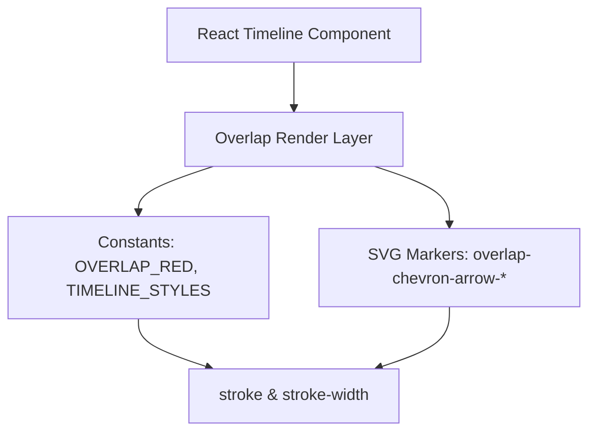

## 1. 架构设计


## 2. 技术描述
- 前端：React@18 + D3@7 + TailwindCSS@3
- 初始化工具：vite-init
- 后端：无（纯前端视图）

## 3. 路由定义
| 路由 | 目的 |
|------|------|
| /dashboard/planning | 时间线主视图，展示Overlap连线与图标 |

## 4. 实现要点
### 4.1 常量定义
在 `src/view/Dashboard/PlanningView/index.jsx` 顶部新增：
```js
const OVERLAP_RED = '#800020';
```
并统一 `OVERLAP_COLORS`：
```js
const OVERLAP_COLORS = {
  OPPOSITE:       OVERLAP_RED,
  SAME_DIRECTION: OVERLAP_RED,
  CROSSING:       OVERLAP_RED,
};
```

### 4.2 连线样式
- 将 `CONNECTION_LINE_WIDTH` 改为 `TIMELINE_STYLES.LINE_WIDTH`（或直接引用该值）
- 将 `CONNECTION_LINE_OPACITY` 设为 `1`
- 所有 `stroke` 引用 `OVERLAP_RED` 或 `OVERLAP_COLORS.*`

### 4.3 图标样式
- 在 marker 定义处（`overlap-chevron-arrow-opposite` / `same`）将 `fill` 与 `stroke` 改为 `OVERLAP_RED`
- 保持 `fill-opacity: ARROW_FILL_OPACITY`（0.4）

### 4.4 一致性校验
- 全局搜索 `stroke="`, `marker-end`, `OVERLAP_COLORS` 确保无遗漏
- 若存在按类型赋色逻辑，统一走 `OVERLAP_COLORS`（已同色）

## 5. 数据模型
无后端数据模型变更，仅前端样式常量调整。

## 6. 回滚策略
- 还原 `OVERLAP_RED` 为原三色或独立颜色
- 恢复 `CONNECTION_LINE_WIDTH` / `OPACITY` 为原值